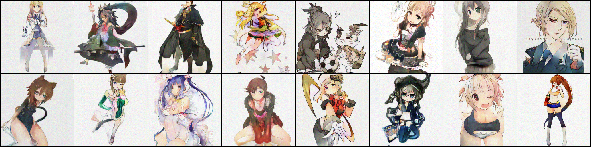

# Anime Sketch Colorization GAN



A full-stack, AI-powered web application that automatically transforms black-and-white anime sketches into beautifully colored, high-resolution masterpieces.

##  Features
*   **Custom cGAN Architecture**: Built upon a customized Attention U-Net Generator and a PatchGAN discriminator, trained iteratively for 195 epochs to ensure accurate line-art detection and vibrant color prediction.
*   **Real-ESRGAN Integrated Upscaling**: Generates incredibly sharp 1024x1024 high-resolution outputs natively on the server by running the standard 256x256 GAN outputs through the ESRGAN `x4plus_anime_6B` weights.
*   **Guided Color Transfer (Reinhard Algorithm)**: Optionally upload a reference colored image. The backend extracts its color histogram and transfers the entire mood and palette onto your colorized sketch using OpenCV.
*   **Premium Glassmorphism UI**: A dark, ultra-modern frontend built with zero bloated JS dependencies—just pure, blazing-fast CSS masks and fetch loops.

## 🛠️ Tech Stack
*   **Deep Learning**: PyTorch, TorchVision
*   **Computer Vision**: OpenCV (`cv2`), Real-ESRGAN, BasicSR
*   **Backend Server**: Python FastAPI, Uvicorn
*   **Frontend**: HTML5, Vanilla CSS3 (Glassmorphism), JavaScript

##  Getting Started

### 1. Requirements
Python 3.8+ is recommended. Ensure you have the trained weights in the root directory:
*   `generator.pth` (Your trained 195-epoch cGAN weights)
*   `latestOutput/RealESRGAN_x4plus_anime_6B.pth` (Real-ESRGAN upscaler weights)

### 2. Installation
Clone the repository and install the backend dependencies:
```bash
git clone https://github.com/Prateekiiitg56/SketchColured.git
cd SketchColor
pip install -r requirements.txt
```

### 3. Running the Server
Start the FastAPI server via Uvicorn:
```bash
uvicorn app:app --reload --port 8000
```
Open your browser to `http://localhost:8000` to interact with the application.

##  Model Training Details
The model was trained on the Anime Sketch Colorization Pair dataset. To address classic cGAN challenges like mode collapse (e.g. flat brown hues), this pipeline relies on dropout stabilization at inference time combined with instance normalization at the bottleneck.

##  License
MIT License. Feel free to use this project for your own generative ML research.
